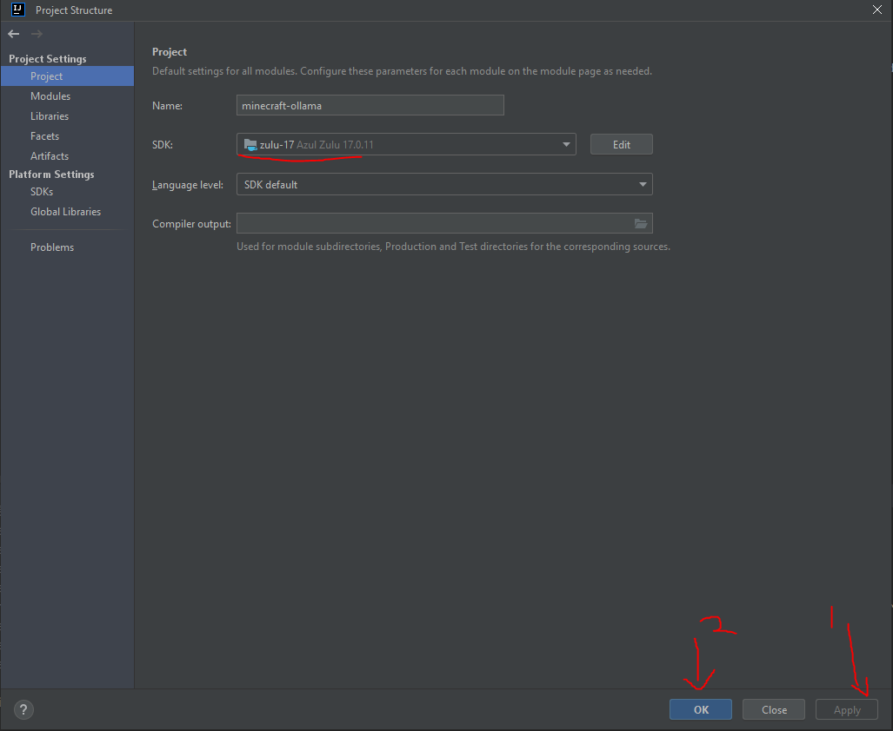
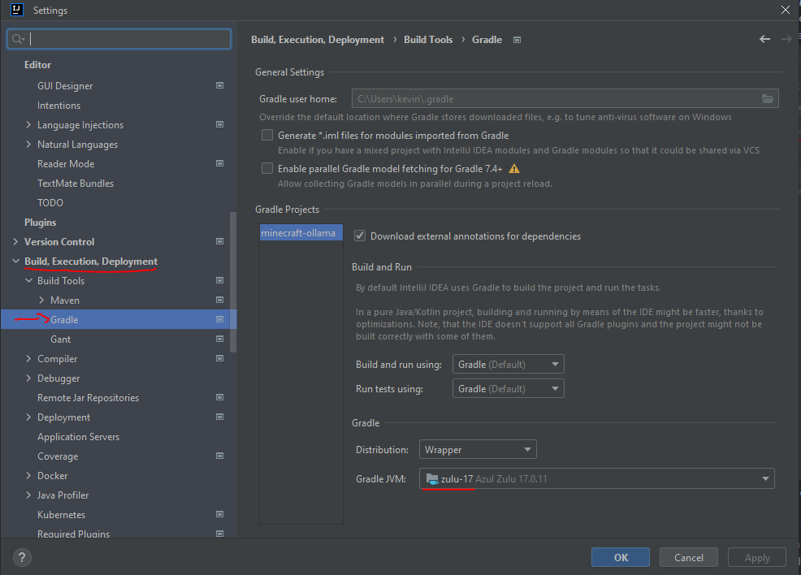
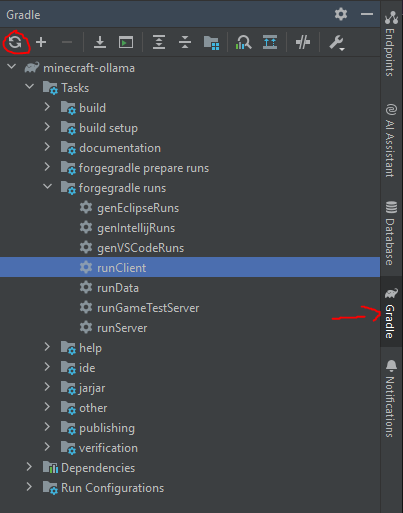
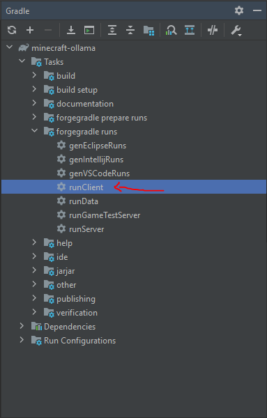

## Setup Development Environment
* Get and IDE like IntelliJ IDEA. I would recommend IntelliJ as that is what the Code owners will use and this setup uses.
* Get a Java Development Kit (JDK) of [Azul 17.0.X JDK](https://www.azul.com/downloads/?version=java-17-lts&os=windows&package=jdk#zulu) and on installation:
  * Add it to `PATH` by setting ***Will be installed on local hard drive***.
  * Change **Set JAVA_HOME variable** to ***Will be installed on local hard drive***
  * Clone the repository and open with IntelliJ (or others somehow)
    * Set the Project SDK to `zulu-17`. If the language level is not `SDK Default`, change it to `17`. (Do `CTRL+ALT+SHIFT+S` and it will be under **Project** as seen below)  
    
    * Set the gradle jvm to also be `zulu-17`. (Do `CTRL+ALT+S` and search **gradle** as seen below)  
    
    * Allow for gradle to set up environment with Forge. If this does not happen, run a build with gradle, and it should get everything.  
    
    * Most of the setup will already be done. We are utilizing [parchment](https://parchmentmc.org/docs/getting-started) instead of **official**.
      * Mapping versions can be found on the site. Ensure the mapping versions matches in `/gradle-properties`.
    * For first time setup (or maybe on first clone), run `./gradlew genIntellijRuns` in a terminal in IntelliJ for run configurations.
    * Do either to run the mod:
      * In the `gradle` tab, you can now open to `minecraft-ollama/Tasks/forgegradle runs/runClient` and run that to open Minecraft with the Mod.  
      
        * You will see it here in run configurations, so you can run it again.
      
      * On top of IntelliJ, you can find your run configurations.
        * Choose `runClient` and press play.  
        
    
