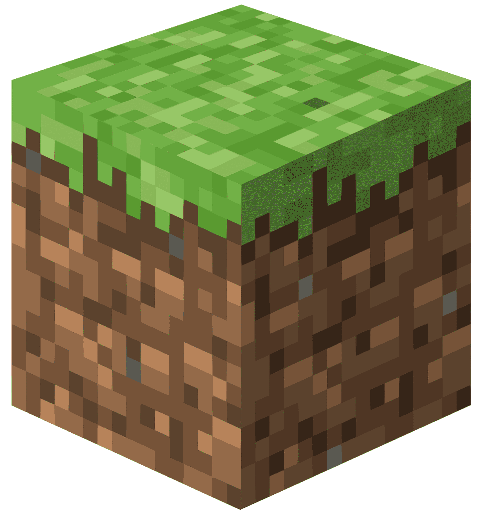

    
<a href="#"></a>

    <h1>Minecraft Ollama Integration</h1>
    <h3>Ollama as your Minecraft World Overseer</h3>
    

    
    <!--  -->

## About/Goals
It would be awesome to implement [Ollama](https://ollama.com/) into Minecraft as a Mod/Plugin where you can talk to villagers and have a model that can watch your world and provide context to the player about what is happening in their world (this is why it will be called the Overseer). Another cool thing to do is to add events into the world for the NPCs to talk about!

* [ ] Implement Ollama into minecraft to interact with the player (kind of like an AI pal)
  * [ ] World Events context
  * [ ] Nearby villages context
  * [ ] Village context
    * For example, village was attacked my mobs, village built iron golem, village was raided
  * [ ] Villager context
    * For example, a villager can see a player, villager's friend died in the middle of the night
    * **NOTE**: Conversations likely limited to villagers with jobs 

## Mod vs Plugin?
* A ModPack will disassemble and assemble the game code to add something new into it when building the game.
* A Plugin respects the game code but adds on top of it, it can modify in this tree:
  * data
    * (namespace)
      * advancements (*.json)
      * functions (*.mcfunction)
      * item_modifiers (*.json)
      * loot_tables (*.json)
      * predicates (*.json)
      * recipes (*.json)
      * structures (*.nbt)

## Resources
* [Minecraft Forge](https://github.com/MinecraftForge/MinecraftForge)
* [Forge Modding Tutorials](https://moddingtutorials.org/)
* [Minecraft Wiki](https://minecraft.wiki/) for NPC interactions
  * [Structure](https://minecraft.wiki/w/Structure)
  * [Village](https://minecraft.wiki/w/Village)
    * [Villager](https://minecraft.wiki/w/Villager)
    * [Iron Golem](https://minecraft.wiki/w/Iron_Golem)
  * [Pillager Outpost](https://minecraft.wiki/w/Pillager_Outpost)
    * [Pillager](https://minecraft.wiki/w/Pillager)
* [Java Intro with Minecraft Modding](https://www.youtube.com/playlist?list=PLKGarocXCE1FeXvEogpjz4SvHxF_FJRO6)
* [Forge 1.20.X Tutorials](https://www.youtube.com/playlist?list=PLKGarocXCE1H9Y21-pxjt5Pt8bW14twa-)
  * [1.19.X Tutorials](https://www.youtube.com/playlist?list=PLKGarocXCE1HrC60yuTNTGRoZc6hf5Uvl)

## Acknowledgement
* [Kevin Dang](https://github.com/kevinthedang)

[minecraft-ollama](https://github.com/kevinthedang/minecraft-ollama) © 2024 by [Kevin Dang](https://github.com/kevinthedang) is licensed under [CC BY 4.0](https://creativecommons.org/licenses/by/4.0/)